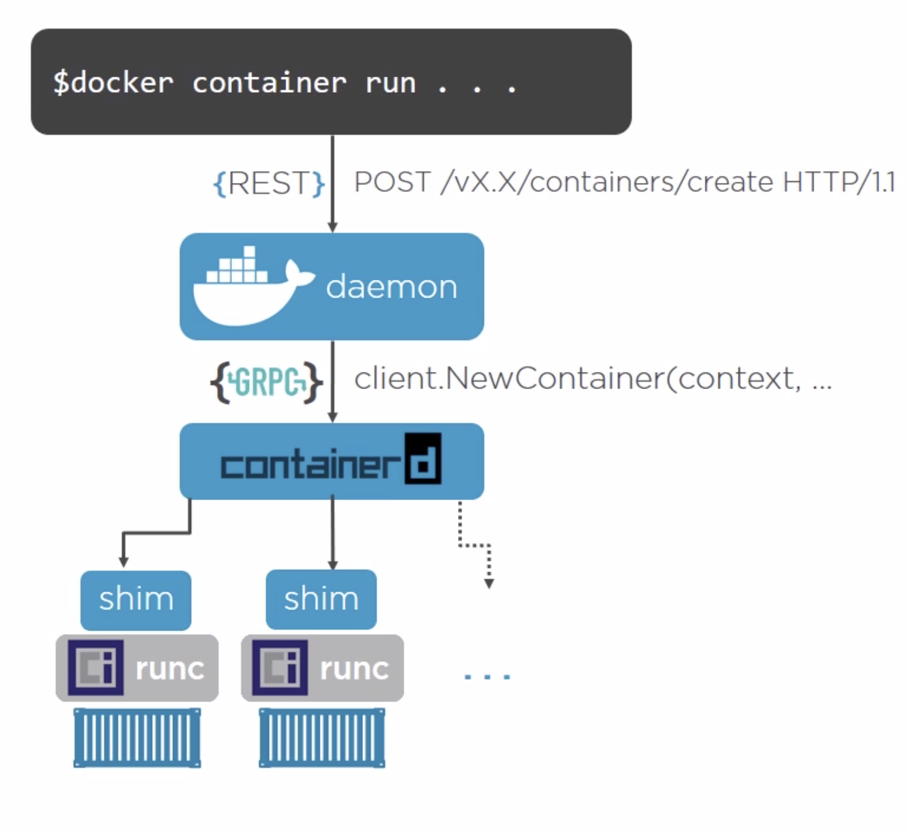

<ol class="breadcrumb">
  <li><a href="/Docker">Docker</a></li>
  <li class="active">Docker commands</li>
</ol>

<div>
        {{ page.date | date: "%-d %B %Y" }}
</div>
<br>

<h3>Installing docker on linux</h3>
```
curl -fsSL https://test.docker.com -o test-docker.sh
```
<h3>Controlling docker daemon</h3>

```
systemctl start|stop|restart|status docker
```

<h3>Docker engine components</h3>
