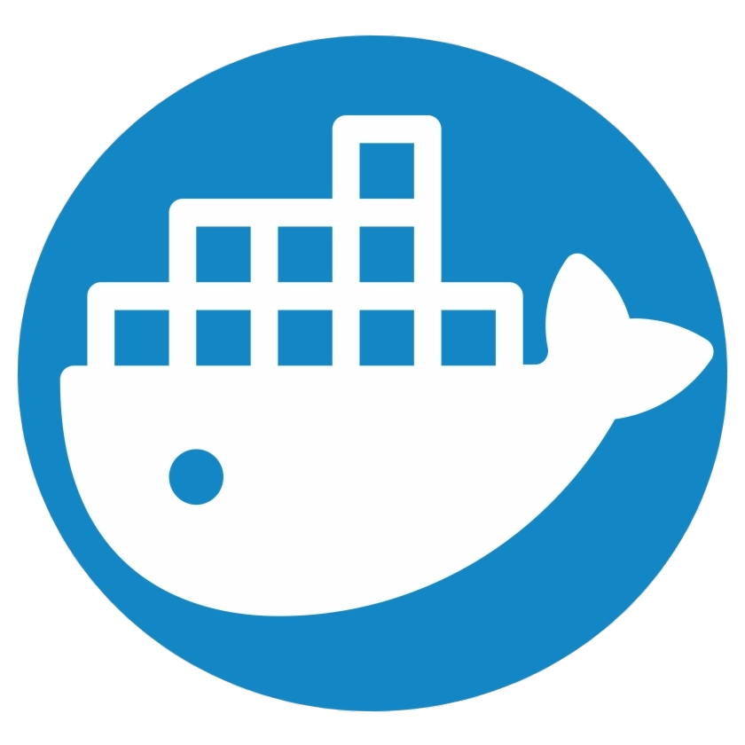

{{ page.date | date_to_long_string }}

# About Me

<!-- Masthead-->

            <header class="masthead bg-primary text-white text-center">
                

                    <!-- Masthead Avatar Image-->
                    
                    <!-- Masthead Heading-->
                    <h1 class="masthead-heading text-uppercase mb-0">io.github.huthesh</h1>
                    <!-- Icon Divider-->
                    

                        

                        
<i class="fas fa-star"></i>

                        

                    

                

            </header>
            <!-- Portfolio Section-->
            <section class="page-section portfolio" id="portfolio">
                

                    <!-- Icon Divider-->
                    

                        

                        
<i class="fas fa-star"></i>

                        

                    

                    <!-- Portfolio Grid Items-->
                    

                        <!-- Portfolio Item 1-->
                        

                            

                                <a href="/Java">  

                                  
Java

                                
</a>
                                
                            

                        

                        <!-- Portfolio Item 2-->
                        

                            

                                

                                    
Docker

                                

                                 
                            

                        

                        <!-- Portfolio Item 3-->
                        

                            

                                

                                    
Spring

                                

                                
                            

                        

                        <!-- Portfolio Item 4-->
                        

                            

                                

                                    
Mongo DB

                                

                                
                            

                        

                        <!-- Portfolio Item 5-->
                        

                            

                                

                                    
Git

                                

                                
                            

                        

                        <!-- Portfolio Item 6-->
                        

                            

                                

                                    
Kubernetes

                                

                                
                            

                        

                    

                     

                        

                        
<i class="fas fa-star"></i>

                        

                    

                

            </section>
            <!-- About Section-->
            <section class="page-section bg-primary text-white mb-0" id="about">
                

                    <!-- About Section Heading-->
                    <h2 class="page-section-heading text-center text-uppercase text-white">About</h2>
                    <!-- Icon Divider-->
                    

                        

                        
<i class="fas fa-star"></i>

                        

                    

                    <!-- About Section Content-->
                    

                        

I am working here for 12 years The download includes the complete source files including HTML, CSS, and JavaScript as well as optional SASS stylesheets for easy customization.

                        

You can create your own custom avatar for the masthead, change the icon in the dividers, and add your email address to the contact form to make it fully functional!

                    

                

            </section>
            
            <!-- Copyright Section-->
            

                
<small>Copyright © huthesh.github.io 2020</small>

            

            <!-- Scroll to Top Button (Only visible on small and extra-small screen sizes)-->
            

                <a class="js-scroll-trigger d-block text-center text-white rounded" href="#page-top"><i class="fa fa-chevron-up"></i></a>
            

            <!-- Portfolio Modals-->
            <!-- Portfolio Modal 1-->
            

                

                    

                        <button class="close" type="button" data-dismiss="modal" aria-label="Close">
                            <i class="fas fa-times"></i>
                        </button>
                        

                            

                                

                                    

                                        <!-- Portfolio Modal - Title-->
                                        <h2 class="portfolio-modal-title text-secondary text-uppercase mb-0" id="portfolioModal1Label">Log Cabin</h2>
                                        <!-- Icon Divider-->
                                        

                                            

                                            
<i class="fas fa-star"></i>

                                            

                                        

                                        <!-- Portfolio Modal - Image-->
                                        
                                        <!-- Portfolio Modal - Text-->
                                        
Lorem ipsum dolor sit amet, consectetur adipisicing elit. Mollitia neque assumenda ipsam nihil, molestias magnam, recusandae quos quis inventore quisquam velit asperiores, vitae? Reprehenderit soluta, eos quod consequuntur itaque. Nam.

                                        <button class="btn btn-primary" data-dismiss="modal">
                                            <i class="fas fa-times fa-fw"></i>
                                            Close Window
                                        </button>
                                    

                                

                            

                        

                    

                

            

            <!-- Portfolio Modal 2-->
            

                

                    

                        <button class="close" type="button" data-dismiss="modal" aria-label="Close">
                            <i class="fas fa-times"></i>
                        </button>
                        

                            

                                

                                    

                                        <!-- Portfolio Modal - Title-->
                                        <h2 class="portfolio-modal-title text-secondary text-uppercase mb-0" id="portfolioModal2Label">Tasty Cake</h2>
                                        <!-- Icon Divider-->
                                        

                                            

                                            
<i class="fas fa-star"></i>

                                            

                                        

                                        <!-- Portfolio Modal - Image-->
                                        
                                        <!-- Portfolio Modal - Text-->
                                        
Lorem ipsum dolor sit amet, consectetur adipisicing elit. Mollitia neque assumenda ipsam nihil, molestias magnam, recusandae quos quis inventore quisquam velit asperiores, vitae? Reprehenderit soluta, eos quod consequuntur itaque. Nam.

                                        <button class="btn btn-primary" data-dismiss="modal">
                                            <i class="fas fa-times fa-fw"></i>
                                            Close Window
                                        </button>
                                    

                                

                            

                        

                    

                

            

            <!-- Portfolio Modal 3-->
            

                

                    

                        <button class="close" type="button" data-dismiss="modal" aria-label="Close">
                            <i class="fas fa-times"></i>
                        </button>
                        

                            

                                

                                    

                                        <!-- Portfolio Modal - Title-->
                                        <h2 class="portfolio-modal-title text-secondary text-uppercase mb-0" id="portfolioModal3Label">Circus Tent</h2>
                                        <!-- Icon Divider-->
                                        

                                            

                                            
<i class="fas fa-star"></i>

                                            

                                        

                                        <!-- Portfolio Modal - Image-->
                                        
                                        <!-- Portfolio Modal - Text-->
                                        
Lorem ipsum dolor sit amet, consectetur adipisicing elit. Mollitia neque assumenda ipsam nihil, molestias magnam, recusandae quos quis inventore quisquam velit asperiores, vitae? Reprehenderit soluta, eos quod consequuntur itaque. Nam.

                                        <button class="btn btn-primary" data-dismiss="modal">
                                            <i class="fas fa-times fa-fw"></i>
                                            Close Window
                                        </button>
                                    

                                

                            

                        

                    

                

            

            <!-- Portfolio Modal 4-->
            

                

                    

                        <button class="close" type="button" data-dismiss="modal" aria-label="Close">
                            <i class="fas fa-times"></i>
                        </button>
                        

                            

                                

                                    

                                        <!-- Portfolio Modal - Title-->
                                        <h2 class="portfolio-modal-title text-secondary text-uppercase mb-0" id="portfolioModal4Label">Controller</h2>
                                        <!-- Icon Divider-->
                                        

                                            

                                            
<i class="fas fa-star"></i>

                                            

                                        

                                        <!-- Portfolio Modal - Image-->
                                        
                                        <!-- Portfolio Modal - Text-->
                                        
Lorem ipsum dolor sit amet, consectetur adipisicing elit. Mollitia neque assumenda ipsam nihil, molestias magnam, recusandae quos quis inventore quisquam velit asperiores, vitae? Reprehenderit soluta, eos quod consequuntur itaque. Nam.

                                        <button class="btn btn-primary" data-dismiss="modal">
                                            <i class="fas fa-times fa-fw"></i>
                                            Close Window
                                        </button>
                                    

                                

                            

                        

                    

                

            

            <!-- Portfolio Modal 5-->
            

                

                    

                        <button class="close" type="button" data-dismiss="modal" aria-label="Close">
                            <i class="fas fa-times"></i>
                        </button>
                        

                            

                                

                                    

                                        <!-- Portfolio Modal - Title-->
                                        <h2 class="portfolio-modal-title text-secondary text-uppercase mb-0" id="portfolioModal5Label">Locked Safe</h2>
                                        <!-- Icon Divider-->
                                        

                                            

                                            
<i class="fas fa-star"></i>

                                            

                                        

                                        <!-- Portfolio Modal - Image-->
                                        
                                        <!-- Portfolio Modal - Text-->
                                        
Lorem ipsum dolor sit amet, consectetur adipisicing elit. Mollitia neque assumenda ipsam nihil, molestias magnam, recusandae quos quis inventore quisquam velit asperiores, vitae? Reprehenderit soluta, eos quod consequuntur itaque. Nam.

                                        <button class="btn btn-primary" data-dismiss="modal">
                                            <i class="fas fa-times fa-fw"></i>
                                            Close Window
                                        </button>
                                    

                                

                            

                        

                    

                

            

            <!-- Portfolio Modal 6-->
            

                

                    

                        <button class="close" type="button" data-dismiss="modal" aria-label="Close">
                            <i class="fas fa-times"></i>
                        </button>
                        

                            

                                

                                    

                                        <!-- Portfolio Modal - Title-->
                                        <h2 class="portfolio-modal-title text-secondary text-uppercase mb-0" id="portfolioModal6Label">Submarine</h2>
                                        <!-- Icon Divider-->
                                        

                                            

                                            
<i class="fas fa-star"></i>

                                            

                                        

                                        <!-- Portfolio Modal - Image-->
                                        
                                        <!-- Portfolio Modal - Text-->
                                        
Lorem ipsum dolor sit amet, consectetur adipisicing elit. Mollitia neque assumenda ipsam nihil, molestias magnam, recusandae quos quis inventore quisquam velit asperiores, vitae? Reprehenderit soluta, eos quod consequuntur itaque. Nam.

                                        <button class="btn btn-primary" data-dismiss="modal">
                                            <i class="fas fa-times fa-fw"></i>
                                            Close Window
                                        </button>
                                    

                                

                            

                        

                    

                

            

